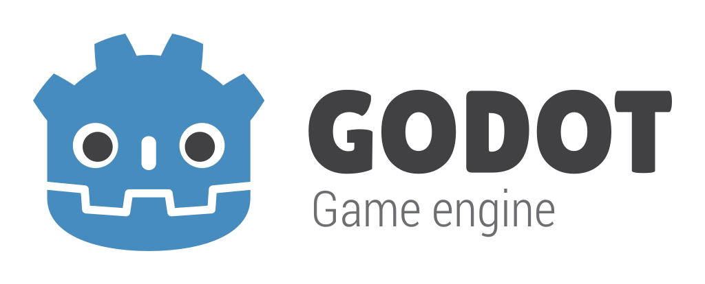
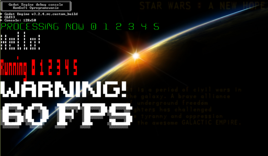

# Godot Engine

<p align="center">
  <a href="https://godotengine.org">
    
  </a>
</p>

**[Godot Engine](https://godotengine.org) is a feature-packed, cross-platform
game engine to create 2D and 3D games from a unified interface.** It provides a
comprehensive set of [common tools](https://godotengine.org/features), so that users can focus on making games
without having to reinvent the wheel. Games can be exported with one click to a
number of platforms, including the major desktop platforms (Linux, macOS,
Windows), mobile platforms (Android, iOS), as well as Web-based platforms
(HTML5) and
[consoles](https://docs.godotengine.org/en/latest/tutorials/platform/consoles.html).

## Support my work ...

You can support my (_Pawel Piecuch_) work on __Godot Engine__ enhancements:

[](https://www.paypal.com/donate?business=6QXS8MBPKBTTN&item_name=Improving+and+enhancing+Godot+Engine.&currency_code=USD)

Find me on **Tweeter** for announcements, more details and discussions: [https://twitter.com/ppiecuch]()

[](https://twitter.com/ppiecuch)


The most important topics and focus of my work:

  1. _Apple Metal_ graphics driver
  2. HK _Odroid-Fo Advance_ and _Super_ consoles
  3. _Nintendo Switch_ port and improvments (only for _Nintendo registered_ users)
  4.  _PS Vita_ (Homebrew) drivers
  5. _2D_ additions and extensions

Some of the things you may found usefull in this repository (look here for all my work [modules/gdextensions/submodules](modules/gdextensions/submodules):

  * Embedded text console [scene/debugconsole](scene/debugconsole) automatically and globally available from both C++ and GDScript (color support, multiply sizes, basic markers/bbcodes, graphical fonts):

  

  * Extension of ```Label``` with transition effects [scene/gui/label_transitions.h](scene/gui/label_transitions.h)
  * *Starfield* component [modules/gdextensions/submodules/environment/starfield/starfield.h](modules/gdextensions/submodules/environment/starfield/starfield.h)
  * _Nixie_-like ```Label``` animation: [modules/gdextensions/submodules/visual/nixie_font.h](modules/gdextensions/submodules/visual/nixie_font.h)
  * _FakeExplosions2D_ particle effect: [modules/gdextensions/submodules/visual/explosion_particles.h](modules/gdextensions/submodules/visual/explosion_particles.h)
  * _BMF_ XML bitmap fonts reader [scene/resources/font.cpp](https://github.com/ppiecuch/godot/blob/master/scene/resources/font.cpp#L211)
  * _SFXR_ Retro Sound FX Generator [modules/gdextensions/submodules/sfxr/gdsfxr.cpp](modules/gdextensions/submodules/sfxr/gdsfxr.cpp)
  * Simple _vector fonts_ (stb_easy_font, leonsans etc) [modules/gdextensions/submodules/geomfonts](modules/gdextensions/submodules/geomfonts)

Some of the modules I am also developing or maintaining every now and then:

  * ```BulletML``` extension for Godot (https://github.com/ppiecuch/gd_bullet_hell.git)
  * ```Chipmunk``` physics for Godot (https://github.com/ppiecuch/gd_chipmunk.git)
  * ```Liquidfun``` physics for Godot (https://github.com/ppiecuch/gd_liquidfun.git)
  * ```ParsePlatform``` communication with Parse Platform backend (https://github.com/ppiecuch/gd_parse_platform.git)

Some additional modules in this repo:
  * ```gdgenerator``` - procedural geometry: [modules/gdgenerator](modules/gdgenerator)
  * ```gdyaml``` - yaml format support: [modules/gdyaml](modules/gdyaml)

Please *notice*, that ```master`` here is _Godot 3_ code (not the _Godot 4_ as in the original repository).

## Godot Engine

Homepage: https://godotengine.org

#### 2D and 3D cross-platform game engine

Godot Engine is a feature-packed, cross-platform game engine to create 2D and
3D games from a unified interface. It provides a comprehensive set of common
tools, so that users can focus on making games without having to reinvent the
wheel. Games can be exported in one click to a number of platforms, including
the major desktop platforms (Linux, Mac OSX, Windows) as well as mobile
(Android, iOS) and web-based (HTML5) platforms.

#### Free, open source and community-driven

Godot is completely free and open source under the very permissive [MIT license](https://godotengine.org/license).
No strings attached, no royalties, nothing. The users' games are theirs, down
to the last line of engine code. Godot's development is fully independent and
community-driven, empowering users to help shape their engine to match their
expectations. It is supported by the Software Freedom Conservancy
not-for-profit.

Before being open sourced in [February 2014](https://github.com/godotengine/godot/commit/0b806ee0fc9097fa7bda7ac0109191c9c5e0a1ac),
Godot had been developed by [Juan Linietsky](https://github.com/reduz) and
[Ariel Manzur](https://github.com/punto-) (both still maintaining the project) for several
years as an in-house engine, used to publish several work-for-hire titles.


### Getting the engine

#### Binary downloads

Official binaries for the Godot editor and the export templates can be found
[on the homepage](https://godotengine.org/download).

#### Compiling from source

[See the official docs](https://docs.godotengine.org/en/latest/development/compiling/)
for compilation instructions for every supported platform.

### Community and contributing

Godot is not only an engine but an ever-growing community of users and engine
developers. The main community channels are listed [on the homepage](https://godotengine.org/community).

The best way to get in touch with the core engine developers is to join the
[Godot Contributors Chat](https://chat.godotengine.org).

To get started contributing to the project, see the [contributing guide](CONTRIBUTING.md).

### Documentation and demos

The official documentation is hosted on [ReadTheDocs](https://docs.godotengine.org).
It is maintained by the Godot community in its own [GitHub repository](https://github.com/godotengine/godot-docs).

The [class reference](https://docs.godotengine.org/en/latest/classes/)
is also accessible from within the engine.

We also maintain official demos in their own [GitHub repository](https://github.com/godotengine/godot-demo-projects)
as well as a list of [awesome Godot community resources](https://github.com/godotengine/awesome-godot).

There are also a number of other learning resources provided by the community,
such as text and video tutorials, demos, etc. Consult the [community channels](https://godotengine.org/community)
for more info.

[](https://github.com/godotengine/godot/actions)
[](https://www.codetriage.com/godotengine/godot)
[](https://hosted.weblate.org/engage/godot-engine/?utm_source=widget)
[](https://lgtm.com/projects/g/godotengine/godot/alerts)
[](https://www.tickgit.com/browse?repo=github.com/godotengine/godot)
